# jistev-dev — Architecture Map

> Generado por **backbone-cli** el 2026-09-14. Regenera con `pnpm map`.

**Stack:** Next.js · React · Framer Motion · Tailwind · TypeScript

## Scripts
| Comando | Acción |
|---|---|
| `dev` | next dev |
| `build` | next build |
| `start` | next start |
| `lint` | eslint |

## Estructura

```
jistev-dev/
.impeccable/
  design.json
public/
  about-zenit/
    delivery.jpg
    fullstack.jpg
    ia.jpg
    stack.jpg
  proj-bg/
    p1.jpg
    p2.jpg
    p3.jpg
    p4.jpg
    p5.jpg
    p6.jpg
    p7.jpg
    p8.jpg
  svc-bg/
    bots.jpg
    ia.jpg
    mvp.jpg
    tools.jpg
  ARCHITECTURE.md
  about-bg.mp4
  about-poster.jpg
  file.svg
  globe.svg
  hero-bg-zenit.mp4
  hero-bg.mp4
  hero-poster-zenit.jpg
  hero-poster.jpg
  logo.png
  next.svg
  services-bg.mp4
  services-poster.jpg
  vercel.svg
  window.svg
raw/
  ARCHITECTURE.md
  zenit_waves.mp4
scripts/

sketches/
  01-editorial-calido/
    index.html
  02-dark-premium/
    delivery.jpg
    fullstack.jpg
    hero-bg-zenit.mp4
    hero-poster-zenit.jpg
    ia.jpg
    index.html
    p1.jpg
    p2.jpg
    p3.jpg
    p4.jpg
    p5.jpg
    p6.jpg
    p7.jpg
    p8.jpg
    stack.jpg
  03-solar-creativo/
    index.html
  ARCHITECTURE.md
src/
  app/
    api/
      contact/
      correo/
      quote/
    correo/
      login/
      page.tsx
    presupuesto/
      page.tsx
    apple-icon.png
    favicon.ico
    globals.css
    icon.png
    layout.tsx
    page.tsx
  components/
    ui/
      badge.tsx
      button.tsx
      card.tsx
      input.tsx
      textarea.tsx
    about.tsx
    capabilities.tsx
    concepts.tsx
    contact.tsx
    faq.tsx
    footer.tsx
    hero.tsx
    method.tsx
    nav.tsx
    section-wrapper.tsx
    services.tsx
    skills.tsx
    tooltip-provider.tsx
  lib/
    data.ts
    gate.ts
    mail-utils.ts
    mail.ts
    motion.ts
    rate-limit.ts
    utils.ts
  ARCHITECTURE.md
  middleware.ts
.env.example
.env.local
.gitignore
AGENTS.md
ARCHITECTURE.md
CLAUDE.md
DESIGN.md
PRODUCT.md
README.md
eslint.config.mjs
next-env.d.ts
next.config.ts
package.json
pnpm-lock.yaml
pnpm-workspace.yaml
postcss.config.mjs
tsconfig.json
```

## Diagrama

```mermaid
graph TD
  root["jistev-dev"]
  n_jistev_dev__impeccable[".impeccable/"]
  root --> n_jistev_dev__impeccable
  n_jistev_dev__impeccable_n_design_json["design.json"]
  n_jistev_dev__impeccable --> n_jistev_dev__impeccable_n_design_json
  n_jistev_dev_public["public/"]
  root --> n_jistev_dev_public
  n_jistev_dev_public_n_delivery_jpg["delivery.jpg"]
  n_jistev_dev_public --> n_jistev_dev_public_n_delivery_jpg
  n_jistev_dev_public_n_fullstack_jpg["fullstack.jpg"]
  n_jistev_dev_public --> n_jistev_dev_public_n_fullstack_jpg
  n_jistev_dev_public_n_ia_jpg["ia.jpg"]
  n_jistev_dev_public --> n_jistev_dev_public_n_ia_jpg
  n_jistev_dev_public_n_stack_jpg["stack.jpg"]
  n_jistev_dev_public --> n_jistev_dev_public_n_stack_jpg
  n_jistev_dev_raw["raw/"]
  root --> n_jistev_dev_raw
  n_jistev_dev_raw_n_ARCHITECTURE_md["ARCHITECTURE.md"]
  n_jistev_dev_raw --> n_jistev_dev_raw_n_ARCHITECTURE_md
  n_jistev_dev_raw_n_zenit_waves_mp4["zenit_waves.mp4"]
  n_jistev_dev_raw --> n_jistev_dev_raw_n_zenit_waves_mp4
  n_jistev_dev_scripts["scripts/"]
  root --> n_jistev_dev_scripts
  n_jistev_dev_sketches["sketches/"]
  root --> n_jistev_dev_sketches
  n_jistev_dev_sketches_n_index_html["index.html"]
  n_jistev_dev_sketches --> n_jistev_dev_sketches_n_index_html
  n_jistev_dev_sketches_n_delivery_jpg["delivery.jpg"]
  n_jistev_dev_sketches --> n_jistev_dev_sketches_n_delivery_jpg
  n_jistev_dev_sketches_n_fullstack_jpg["fullstack.jpg"]
  n_jistev_dev_sketches --> n_jistev_dev_sketches_n_fullstack_jpg
  n_jistev_dev_sketches_n_hero_bg_zenit_mp4["hero-bg-zenit.mp4"]
  n_jistev_dev_sketches --> n_jistev_dev_sketches_n_hero_bg_zenit_mp4
  n_jistev_dev_root_design_json["design.json"]
  root --> n_jistev_dev_root_design_json
  n_jistev_dev_root_delivery_jpg["delivery.jpg"]
  root --> n_jistev_dev_root_delivery_jpg
  n_jistev_dev_root_fullstack_jpg["fullstack.jpg"]
  root --> n_jistev_dev_root_fullstack_jpg
  n_jistev_dev_root_ia_jpg["ia.jpg"]
  root --> n_jistev_dev_root_ia_jpg
```



## Dependencias (23)

- **Prod (13):** class-variance-authority, clsx, framer-motion, html2pdf.js, imapflow, jspdf, lucide-react, mailparser, next, nodemailer, react, react-dom, tailwind-merge

- **Dev (10):** @tailwindcss/postcss, @types/mailparser, @types/node, @types/nodemailer, @types/react, @types/react-dom, eslint, eslint-config-next, tailwindcss, typescript

`104 ficheros · 24 directorios`
