# public — Architecture Map

> Generado por **backbone-cli** el 2026-08-31. Regenera con `pnpm map`.

**Stack:** no detectado

## Scripts
_Sin scripts npm._

## Estructura

```
public/
about-zenit/
  delivery.jpg
  fullstack.jpg
  ia.jpg
  stack.jpg
proj-bg/
  p1.jpg
  p2.jpg
  p3.jpg
  p4.jpg
  p5.jpg
  p6.jpg
  p7.jpg
  p8.jpg
svc-bg/
  bots.jpg
  ia.jpg
  mvp.jpg
  tools.jpg
ARCHITECTURE.md
about-bg.mp4
about-poster.jpg
file.svg
globe.svg
hero-bg-zenit.mp4
hero-bg.mp4
hero-poster-zenit.jpg
hero-poster.jpg
logo.png
next.svg
services-bg.mp4
services-poster.jpg
vercel.svg
window.svg
```

## Diagrama

```mermaid
graph TD
  root["public"]
  n_public_about_zenit["about-zenit/"]
  root --> n_public_about_zenit
  n_public_about_zenit_n_delivery_jpg["delivery.jpg"]
  n_public_about_zenit --> n_public_about_zenit_n_delivery_jpg
  n_public_about_zenit_n_fullstack_jpg["fullstack.jpg"]
  n_public_about_zenit --> n_public_about_zenit_n_fullstack_jpg
  n_public_about_zenit_n_ia_jpg["ia.jpg"]
  n_public_about_zenit --> n_public_about_zenit_n_ia_jpg
  n_public_about_zenit_n_stack_jpg["stack.jpg"]
  n_public_about_zenit --> n_public_about_zenit_n_stack_jpg
  n_public_proj_bg["proj-bg/"]
  root --> n_public_proj_bg
  n_public_proj_bg_n_p1_jpg["p1.jpg"]
  n_public_proj_bg --> n_public_proj_bg_n_p1_jpg
  n_public_proj_bg_n_p2_jpg["p2.jpg"]
  n_public_proj_bg --> n_public_proj_bg_n_p2_jpg
  n_public_proj_bg_n_p3_jpg["p3.jpg"]
  n_public_proj_bg --> n_public_proj_bg_n_p3_jpg
  n_public_proj_bg_n_p4_jpg["p4.jpg"]
  n_public_proj_bg --> n_public_proj_bg_n_p4_jpg
  n_public_svc_bg["svc-bg/"]
  root --> n_public_svc_bg
  n_public_svc_bg_n_bots_jpg["bots.jpg"]
  n_public_svc_bg --> n_public_svc_bg_n_bots_jpg
  n_public_svc_bg_n_ia_jpg["ia.jpg"]
  n_public_svc_bg --> n_public_svc_bg_n_ia_jpg
  n_public_svc_bg_n_mvp_jpg["mvp.jpg"]
  n_public_svc_bg --> n_public_svc_bg_n_mvp_jpg
  n_public_svc_bg_n_tools_jpg["tools.jpg"]
  n_public_svc_bg --> n_public_svc_bg_n_tools_jpg
  n_public_root_delivery_jpg["delivery.jpg"]
  root --> n_public_root_delivery_jpg
  n_public_root_fullstack_jpg["fullstack.jpg"]
  root --> n_public_root_fullstack_jpg
  n_public_root_ia_jpg["ia.jpg"]
  root --> n_public_root_ia_jpg
  n_public_root_stack_jpg["stack.jpg"]
  root --> n_public_root_stack_jpg
```



## Dependencias (0)

`31 ficheros · 4 directorios`
