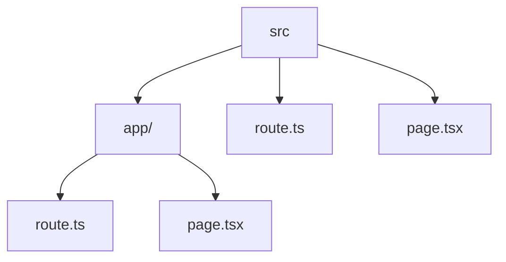

# src — Architecture Map

> Generado por **backbone-cli** el 2026-08-31. Regenera con `pnpm map`.

**Stack:** no detectado

## Scripts
_Sin scripts npm._

## Estructura

```
src/
app/
  api/
    contact/
      route.ts
    correo/
      attachment/
      auth/
      bulk/
      delete/
      folders/
      list/
      logout/
      read/
      send/
    quote/
      route.ts
  correo/
    login/
      page.tsx
    page.tsx
  presupuesto/
    page.tsx
  apple-icon.png
  favicon.ico
  globals.css
  icon.png
  layout.tsx
  page.tsx
components/
  ui/
    badge.tsx
    button.tsx
    card.tsx
    input.tsx
    textarea.tsx
  about.tsx
  capabilities.tsx
  concepts.tsx
  contact.tsx
  faq.tsx
  footer.tsx
  hero.tsx
  method.tsx
  nav.tsx
  section-wrapper.tsx
  services.tsx
  skills.tsx
  tooltip-provider.tsx
lib/
  data.ts
  gate.ts
  mail-utils.ts
  mail.ts
  motion.ts
  rate-limit.ts
  utils.ts
ARCHITECTURE.md
middleware.ts
```

## Diagrama



## Dependencias (0)

`38 ficheros · 21 directorios`
